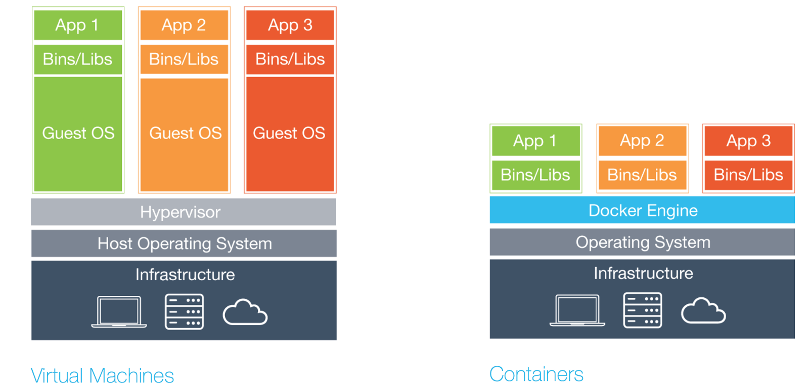

## Local Development with


---

## What is Docker?


+++

Docker is a tool designed to make it easier to create, deploy, and run applications by using containers.

https://www.docker.com/what-container

+++


---

## The Challenges

- It works on my machine 
- Running microservices locally is hard |
- It takes weeks for my code to get to production |
- All my time is spent on environment config instead of application code |

---

## How does Docker help?

- Simplifies building, shipping, and running apps
- Provides a 'containerization' system for code |
- Runs natively on Linux and Windows Server |
- Runs with on Windows or Mac using Docker CE |

+++

Image: a read-only template composed of layered file systems used to share common files and create Docker container instances

+++

Container: an isolated and secured shipping container created from an image that can be run, started, stopped, moved, and deleted

+++



+++

Explore and share images on [Docker Hub](https://hub.docker.com/explore/)


| Repository | Stars |
| :--------: | ----: |
| nginx      | 8.2K  |
| redis      | 4.9K  |
| ubuntu     | 7.4K  |
| mysql      | 5.9K  |
| postgres   | 4.7K  |
| node       | 5.3K  |

## Demo

+++

Run a container

```bash
docker run hello-world
```

+++

Run an ubuntu container with an interactive terminal 

```bash
docker run -it ubuntu
```

+++

Start a server using an nginx container

```bash
docker run -d -p 8080:80 nginx
```

+++

Persist data using volumes

```bash
docker run -it -v data:/data ubuntu bash
```
Run a brand new project with no setup using `docker-compose`

```bash
git clone https://github.com/dgageot/dockercon16.git
docker-compose up -d
```

---

## Key Benefits

- Configuration Simplification
- Pipeline Management (CI/CD)
- App Isolation
- Rapid Deployment
- Closer to Production Environment

---

## Resources

+++

### Documentation / Tutorials

- [What is a container - Docker](https://www.docker.com/what-container)
- [Local WordPress Development with Docker](https://gitpitch.com/lewebsimple/docker-wordpress?grs=github&t=white#/)
- [How docker-compose changed my life - Youtube](https://www.youtube.com/watch?v=ADFSk7IbfAI)
- [What every Angular Developer Should know about Docker - Youtube](https://www.youtube.com/watch?v=socWfhPJptE)
- [Docker for Developers - Youtube](https://www.youtube.com/watch?v=SK0sqfVn7ls)

+++

### Images

- [Docker Logo](http://1000logos.net/wp-content/uploads/2017/07/Docker-Logo.png)
- [Shipping Barge](https://theloadstar.co.uk/wp-content/uploads/%C2%A9-Roza-_l_20426071.jpg)
- [Docker vs VM](https://medium.com/@edmondsonl/the-evolution-of-virtualization-to-containers-from-a-lamp-developer-s-perspective-a85a251e8ca1)
- [Volume diagram](https://docs.docker.com/storage/images/types-of-mounts-volume.png)